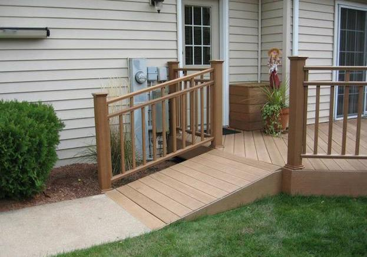

<!-- 
$theme: default 
page_number: true
footer: A Barnardo's Lunch and Learn Production
-->

# Learn you some Accessibility for Great Good

# :heart:

---


> The power of the Web is in its universality. 
Access by everyone regardless of disability is an essential aspect.

<cite>Tim Berners-Lee</cite> (inventor of the World Wide Web)

---

> The Web is **fundamentally designed to work for all people**, whatever their hardware, software, language, location, or ability. When the Web meets this goal, it is accessible to people with a diverse range of hearing, movement, sight, and cognitive ability.

<cite>W3.org</cite>


---

# What Accessibility needs can people have?

| type | permanent | temporary | situational |
|------|-----------|-----------|-------------|
|:ear: auditory | deaf | ear infection | on a loud train |
|:thought_balloon: cognitive | learning difficulties | hangover | external stimulus |
|:muscle: physical | missing a limb | broken arm | carrying a baby |
|:lips: speech | mute | sore throat | eating |
|:eye: visual | blind | eye infection | sunny day |

---
<!-- *footer: https://www.improvenet.com/a/how-to-a-build-wheelchair-ramp -->

# Accessibility is good for everyone (and it is good for business)

* There are 13.3 million disabled people in the UK.
* 7% of children are disabled 
* 18% of working age adults are disabled
* 44% of pension age adults are disabled

Source: [Family Resources Survey 2015/16](https://www.gov.uk/government/statistics/family-resources-survey-financial-year-201516)

## Accessibility is not exlusionary.



---
<!-- *footer: http://destroywritersblock.blogspot.com/2015/03/beating-academic-block-part-2-of.html -->

# Let's get down to business


---

# How we should "do" accessibility

0. Use the design system <small>(it follows good accessibility practice)</small>
1. Follow a process <small>(we have a spreadsheet based on WCAG AA scoring)</small>
2. Start it early <small>(don't try and layer it on after code has been created)</small>
3. Repeat it often <small>(each PR should be reviewed for accessibility)</small>


---

# Terms

* **A11Y** Short for Accessibility <small>(there are 11 letters between the A and Y)</small>
* **WCAG** Web Content Accessibility Guidelines
* **ARIA** Accessible Rich Internet Applications
* **A-AAA** A scoring system, A is the easiest to achieve AAA is the hardest

---

# Common things to look out for

* Contrast
* Being able to navigate with a keyboard
* That copy is understandable without thought
* Things can be zoomed to 200%
* Images have descriptive or an empty alt attribute
* Headings are in hierarchical order
* Browser page titles are unique and descriptive
* Forms correctly labelled with "for" and "id" attributes
* Page has language defined through 'lang' attribute

---

# ARIA

Adds some semantic labels to interactive elements.

```
<p role="alert">I am an alert</p>
```
<br />

```
<h1 role="presentation">A nice visual header</h1>
```

---

# Tooling

* [WAVE Chrome Plugin](https://chrome.google.com/webstore/detail/wave-evaluation-tool/jbbplnpkjmmeebjpijfedlgcdilocofh)
* VoiceOver (on OS X)
* NVDA screen reader for Windows (https://www.nvaccess.org/download/)
* Accessibility color contrast test (http://gmazzocato.altervista.org/colorwheel/wheel.php)
* Other tools on this website (https://www.w3.org/WAI/ER/tools/)

---
<!-- *footer: https://giphy.com/gifs/studiosoriginals-gilphabet-xTiN0IuPQxRqzxodZm -->

# Questions


---

# Extra Reading

* [WCAG Checklist](https://www.w3.org/WAI/WCAG20/quickref/)
* [How people with disabilities use the web](https://www.w3.org/WAI/intro/people-use-web/Overview)
* [Microsoft's Inclusive Design Guide](https://www.microsoft.com/en-us/design/inclusive)
* [Great list of A11Y resources](https://a11yproject.com/resources.html)
